# Operationalizing Machine Learning in Azure ML Studio

## Overview

* This project is a part Machine Learning Engineer with Microsoft Azure Nanodegree program.

* In this project we implemented end-to-end machine learning project cycle in Azure ML studio. We used Azure ML to create and train the model with AutoML functionality and deploy it. 

* We also created a pipeline to create the model, deploy the model and consumed the model.

* Also the end-point URL of the deployed model is exposed to end-user which they can consume it with sample data.

## Architectural Diagram

* The dataset contains data about phone calls to the customer from a marketing campaigns organised by a bank. So the task to predict if the user will suscribe(1) or not(0).

* So this is a classification problem that we will be solving by Azure ML.

* First we will start the AutoML experiment by uploading the given dataset.

* Then the AutoML will choose best model with optimum parameters, then we will deploy the best model.

* We will enable logging through Application Insights service by updating the service.

* After deployment, we will download the swagger.json file in order to get information about end-points URL.

* Then we will comsume the end-point by http request with authentication key.

* Finally we will implement all these steps using Python SDK.

---

* Following is the architecture of the project :

---

## Key Steps

### Step 1: Authentication

* In local computer we install az command-line tool.

* Login to azure by azure login command.
`az login`

* Install the azure ML extention.
`az extension add -n azure-cli-ml`

* Create the Service Principal with az after login in
`az ad sp create-for-rbac --sdk-auth --name ml-auth`

* Capture the "objectId" using the clientID:
`az ad sp show --id <client_id>`

* Assign the role to the new Service Principal for the given Workspace, Resource Group and User objectId
`az ml workspace share -w <workspace> -g <user> --user <object_id> --role owner`

* workspace and group can be found at machine learning studio or at the config.json file.

---

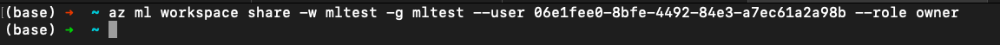

---

## Step 2: Automated ML Experiment

1. Upload the dataset in Azure ML studio.

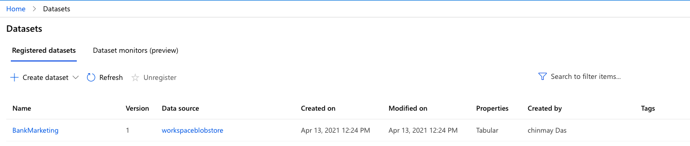

---

2. Creat a AutoML experiment with the given data.

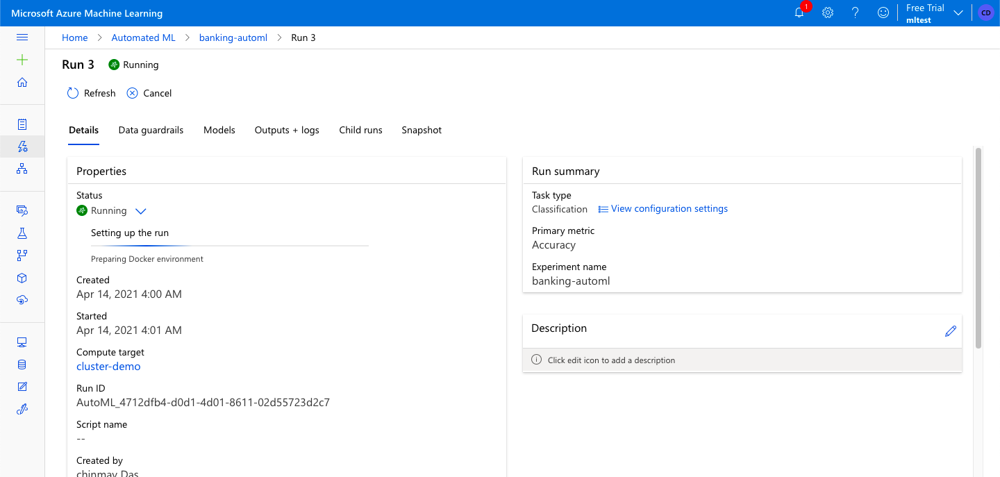

---
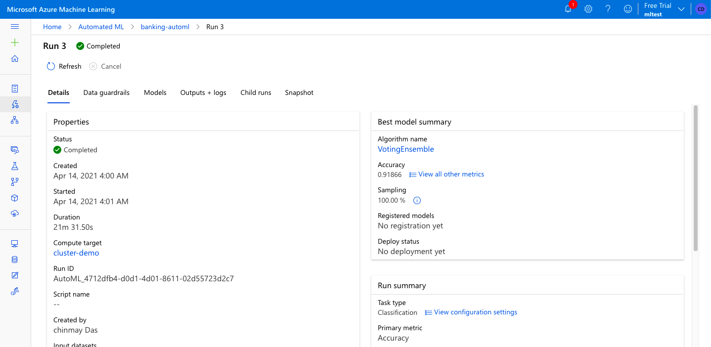

---

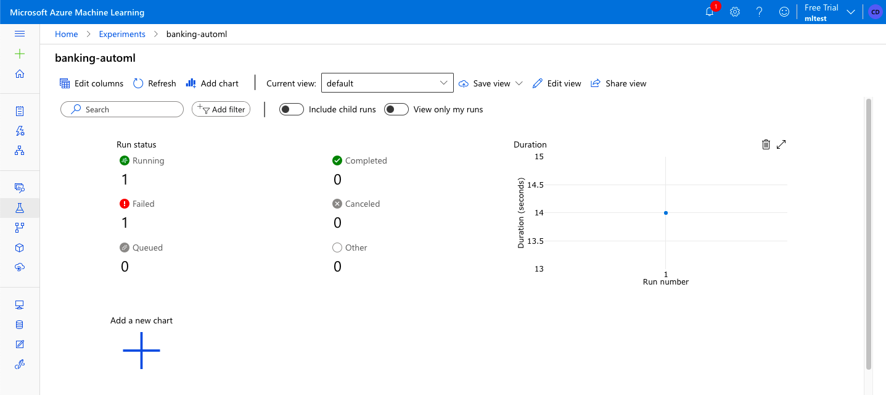

---

3. The best model was VotingEnsamble 

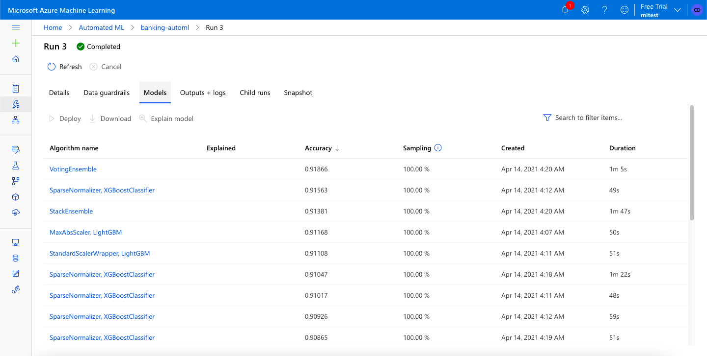

---

### Step 3: Deploy the Best Model

1. Deploy the best model.

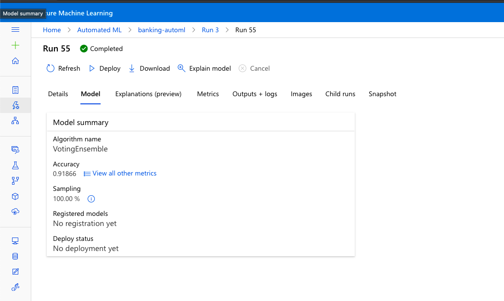

---

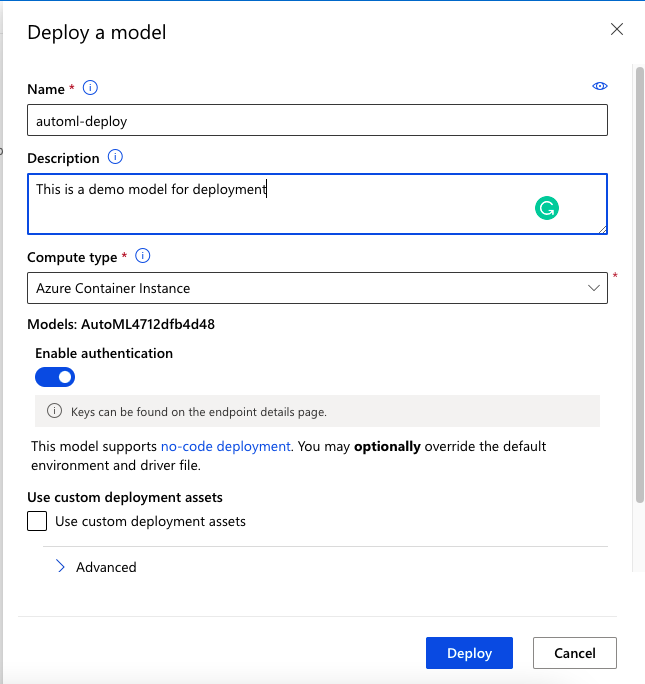

---

---

---

### Step 4: Enable Application Insights

1. Changes the code to update Application insights. then we will run the logs.py to check the log.

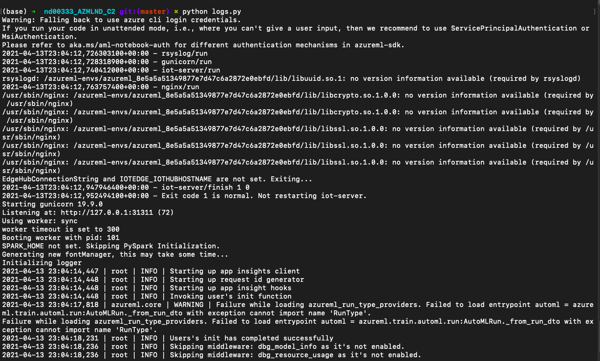

---

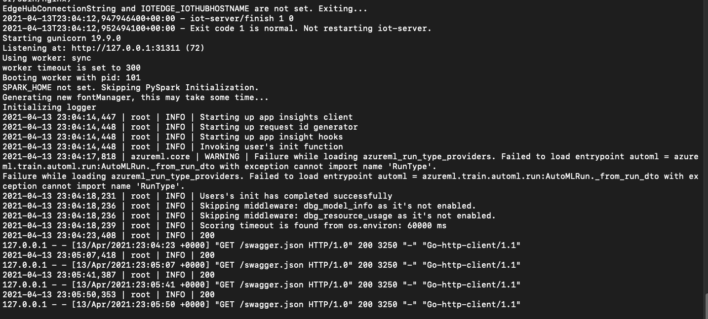

---

2. Check the status of Application insights in the Azure endpoint

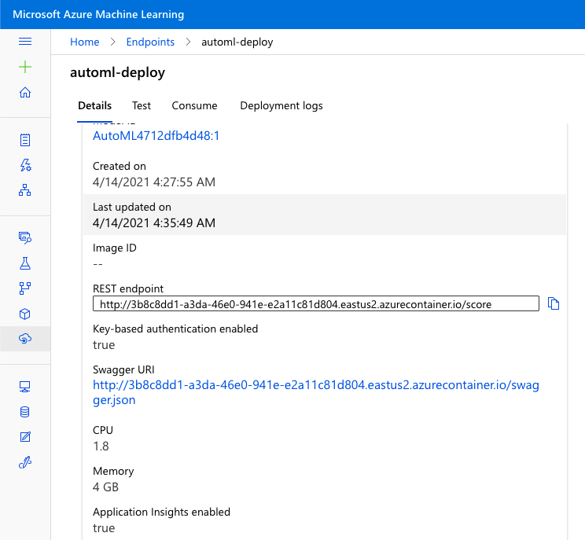

---

### Step 5: Swagger Documentation

1. We will download the file from the endpoint section swagger-URI.

2. Start the docker container, run swagger.sh file and run server.py.
 

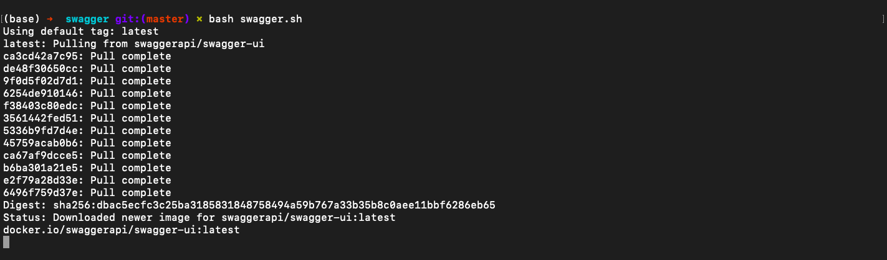

---

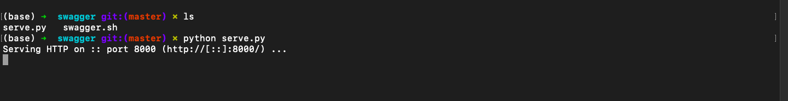

---

3. We will open localhost:8000 to check if all the files are present.

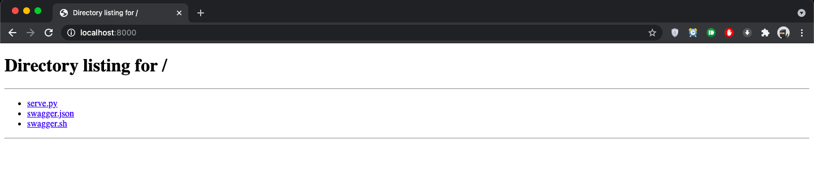

---
4. Check the localhost:8080 to open swagger documentation and give full url path of the swagger json. 

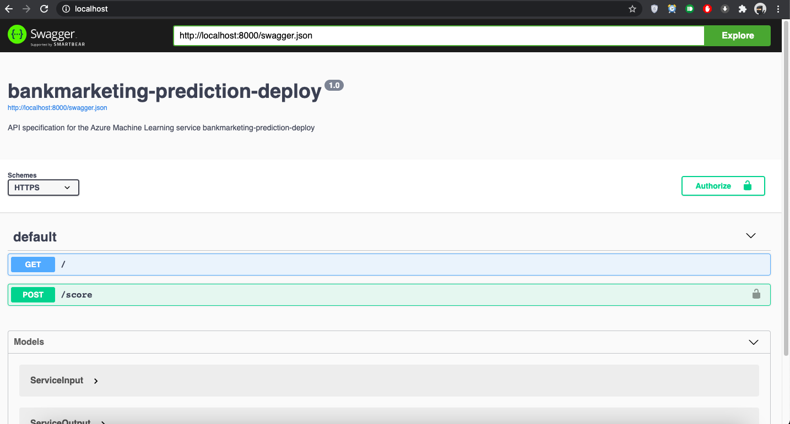

---

5. We will check the model inference POST request methods.

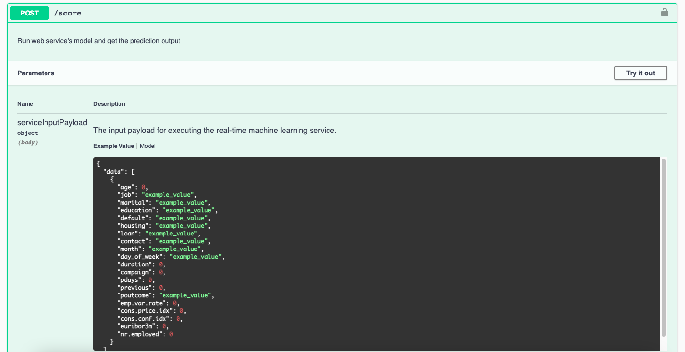

---

6. The we will check the sample input and output parameters.

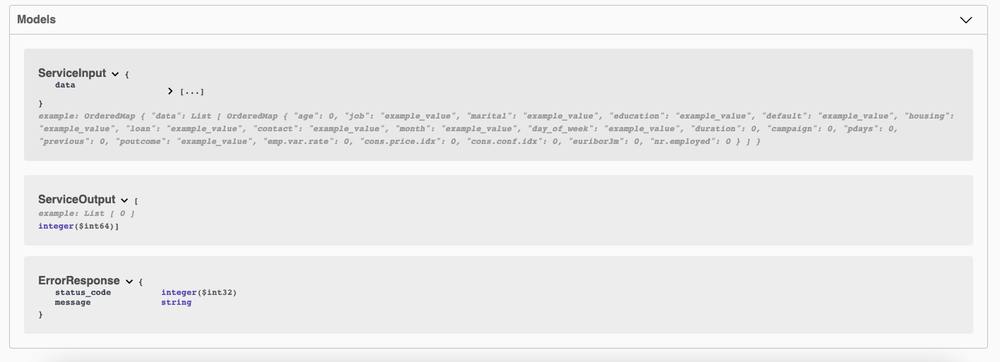

---

### Step 6: Consume Model Endpoints

1. We will modify the endpoint url and key in endpoint.py and run it to check the output.

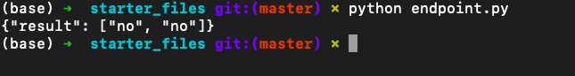

---

2. View Json data generated by the endpoint.py

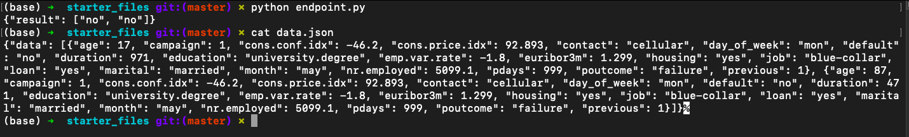

---

3. Run Benchmark.sh to get the model performance. 

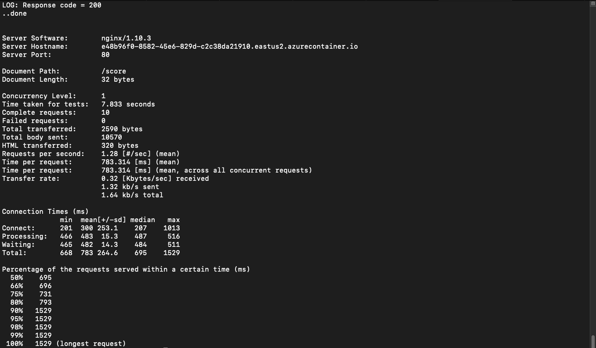

---

### Step 7: Create, Publish and Consume a Pipeline using python SDK

1. We will run the notebook, and check if the pipeline is created. 

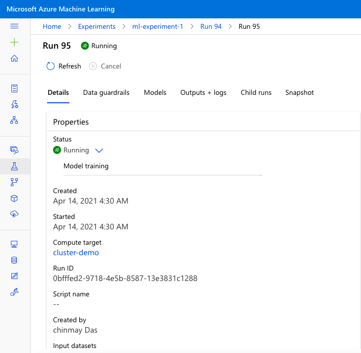

---

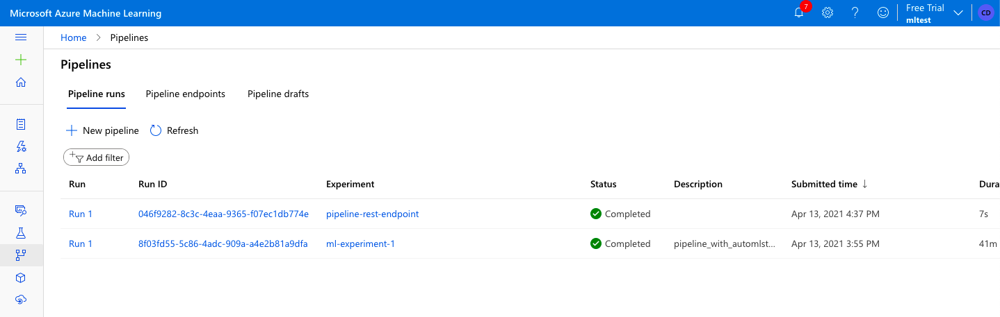

---

2. Overview of the pipeline

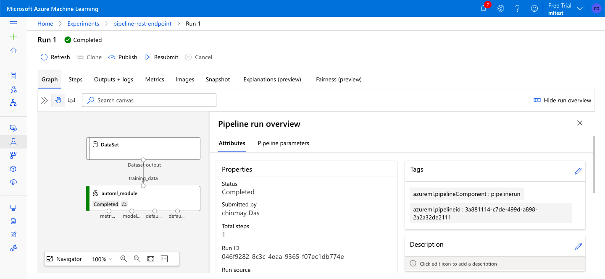

---

3. Pipeline Endpoint with Status Active

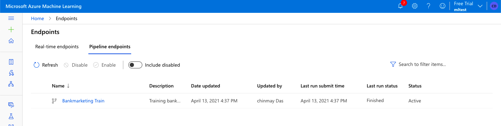

---

4. RunDetails output

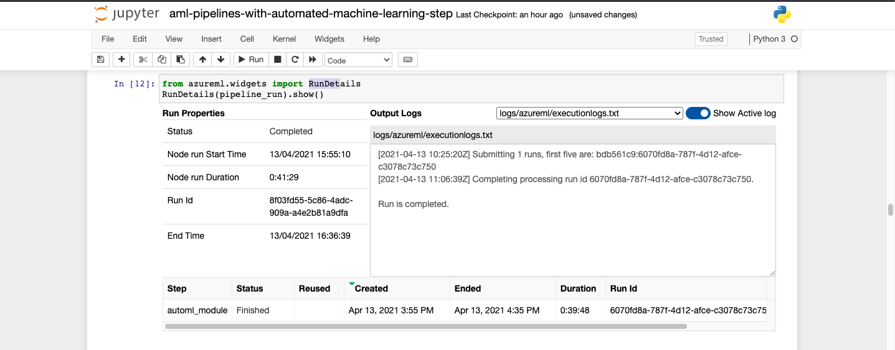

---

5. Publish a pipeline

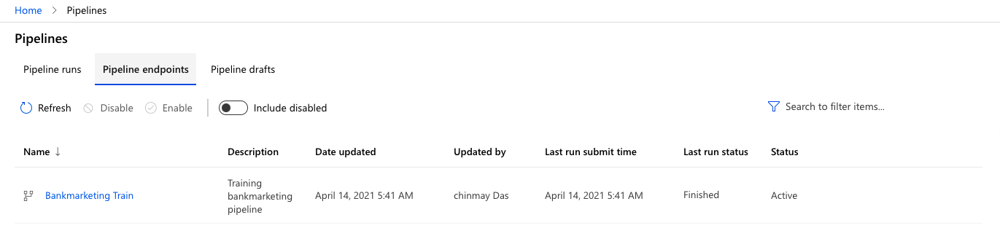

---

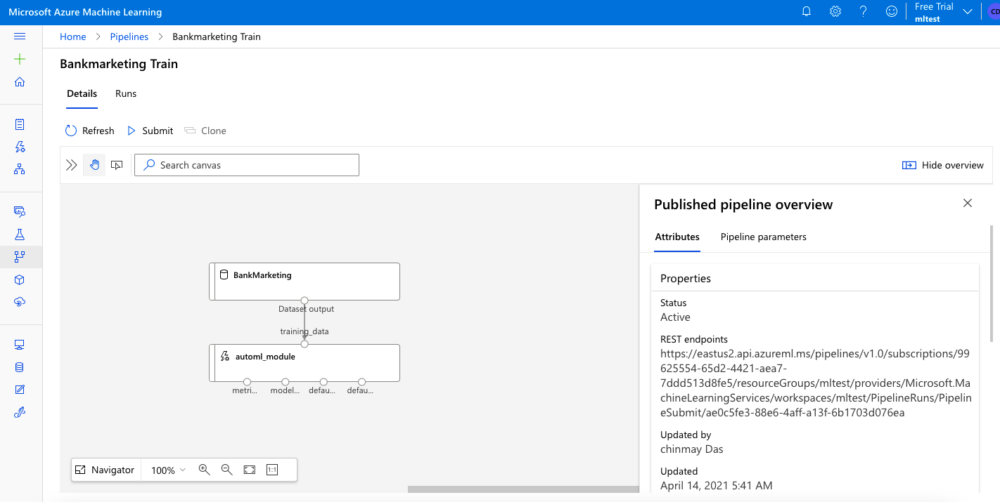

## Screen Recording

[Link](https://www.youtube.com/watch?v=esQIe-Zg0YM) to the Demo.

## Future Improvement

* We can try to increase the dataset to improve the model.

* We can export this model to ONNX for faster inference.

* We can include deep learning model in order get good model accuracy. 